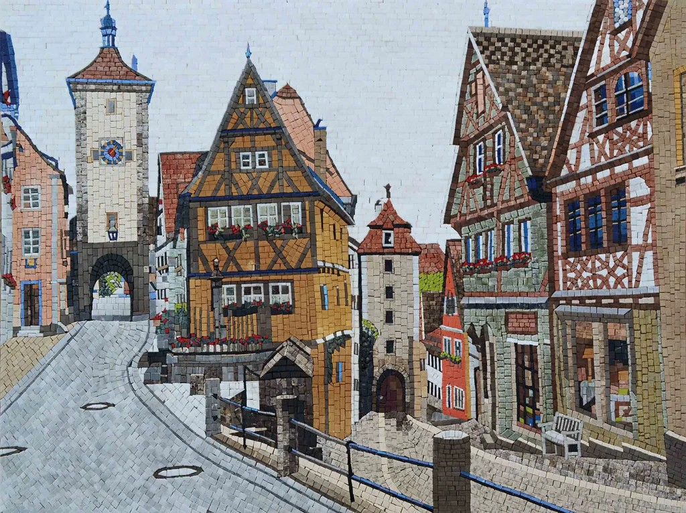

# Welcome to Mosaic Town

This is my personal space on the web, built to house a mosaic of interests. Here you'll find the **Lab** built to keep all the science stuff like my research and academic resources, the **Art Gallery** showcasing my creative projects, and the **Town Square Cafe** for my thoughts and musings. A small **Library** where you'll find my works in literature and an **Observatory** which points not to the vast cosmos but the tangible world around me are under construction. 

Though the parts of the town may seem scattered, they all connect and complement each other to form a single, coherent landscape. And like any town, things here are constantly being destructed, reconstructed, and renovated. I'm glad you're here. Feel free to explore!

---

* **The Lab (My Research):** Dive into my academic work, papers, and scientific projects. **[[Enter]](/research/)**
* **The Art Gallery (My Portfolio):** A gallery of my recent illustrations and creative work. **[[Visit]](/art/)**
* **The Town Square Cafe (My Blog):** Where I share my thoughts, reflections, and new discoveries. **[[Pull up a chair]](/blog/)**
* **The Town Map (Resources):** A curated map of links, tools, and interesting sites I've found. **[[Unfurl]](/resources/)**
